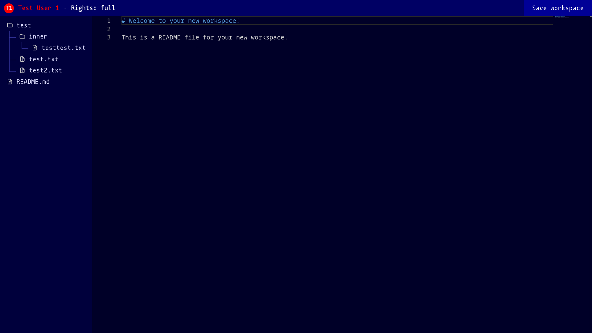

# Monaco Live Editor
**Monaco Live Editor** is an extension for the web-based Monaco editor that allows real-time code collaboration. 

## Features
- Real-time **text update**
- Shows other user's **cursors** and **selected text areas**
- **Multicursor** / multiselection support
- **Multiple workspace** support
- Everything is hosted **locally** on a Node.js server (no 3rd party services)
- Edited files are **saved** on the server
- **New files** can be created
- New users can connect after stream start

## Hosting
1. `npm i monaco-live-editor`
2. Run example script: `node node_modules/monaco-live-editor/example/index.js`
3. Open `http://localhost/`

## Example
The example script can be found under the `example` folder. 

## Credits
- Monaco editor: `microsoft/monaco-editor` 
- Inspired by: `tbvjaos510/monaco-editor-socket-io` 